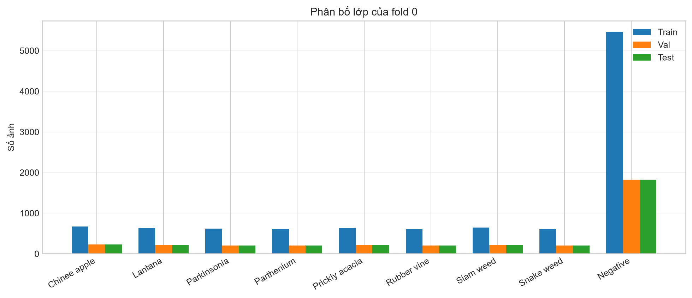
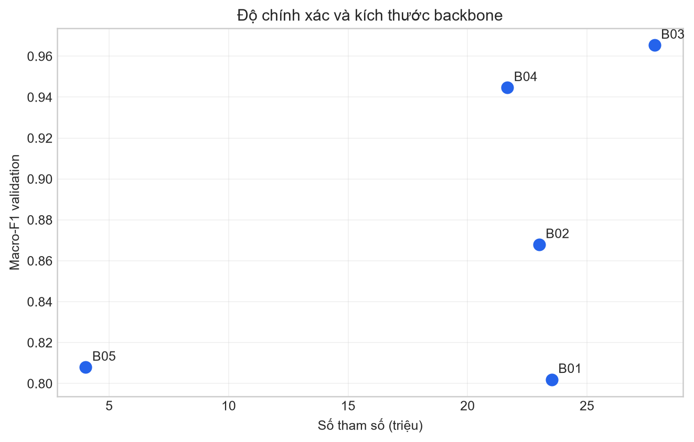
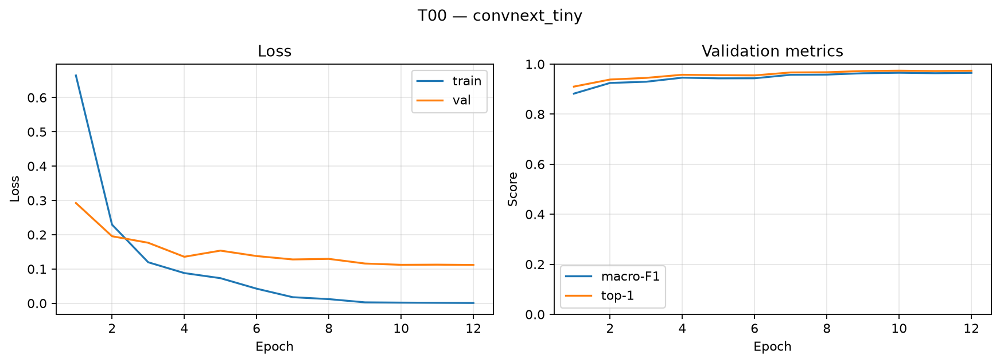
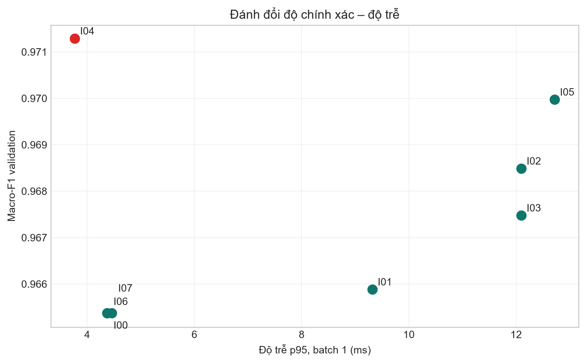
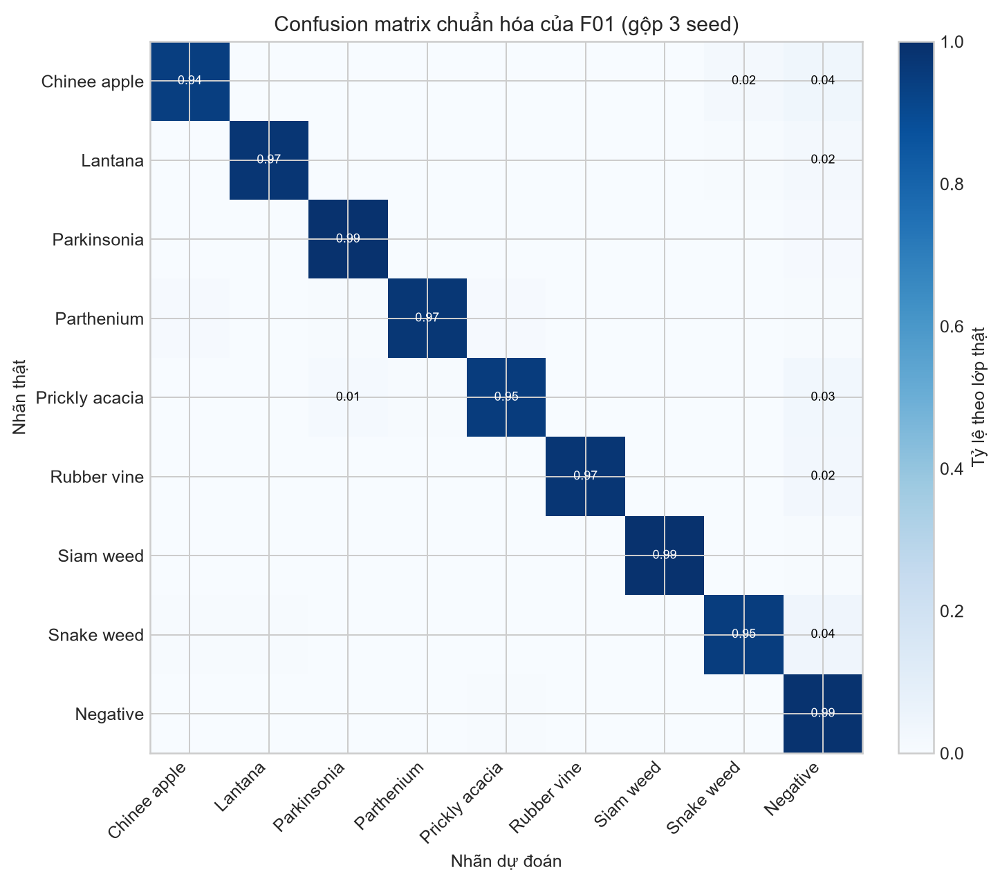
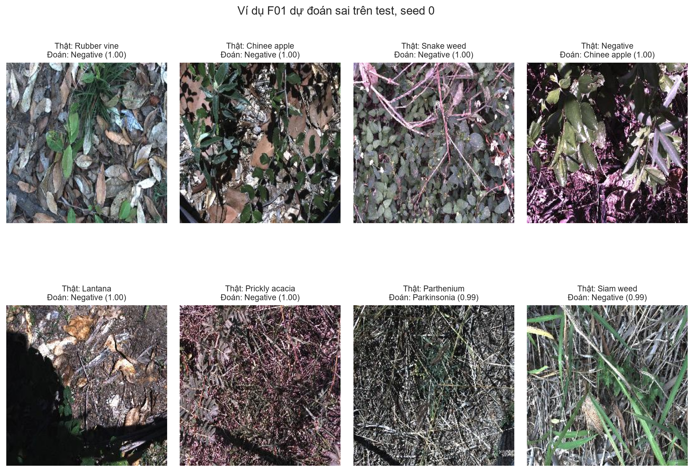

# Báo cáo phân loại cỏ dại DeepWeeds

**Học viên:** Nguyễn Mạnh Cường  
**Mã học viên:** 2A202602823  
**Bài:** Track 4 — Day 2 — Deep Learning Advanced

## 1. Tóm tắt

Bài làm xây dựng một pipeline phân loại DeepWeeds gồm 9 lớp trên fold 0 được cung cấp. Năm backbone, năm thay đổi công thức huấn luyện, một công thức kết hợp và bảy phương pháp suy luận đã được so sánh trên validation. ConvNeXt-Tiny (`B03`) là backbone tốt nhất trong nhóm thử nghiệm. Các cải tiến huấn luyện riêng lẻ chỉ tạo chênh lệch nhỏ; khi kết hợp thành `T10`, macro-F1 giảm nhẹ so với mốc nên công thức nền `T00` được giữ lại. Phương pháp suy luận tốt nhất là một view ở độ phân giải 256 (`I04`). Cấu hình chung kết `F01 = T00 + I04` đạt macro-F1 test **0,97264 ± 0,00098**, top-1 **0,97776 ± 0,00057** qua ba seed. So với mốc `T00 + I00`, macro-F1 tăng **0,00481** và ECE giảm từ **0,01522** xuống **0,01320**. Độ trễ p95 đo riêng forward pass là **3,77 ms/ảnh** trên RTX 5060 Ti.

## 2. Dữ liệu và thiết lập

### 2.1 Dataset và split

Thí nghiệm dùng DeepWeeds và đúng các file `train_subset0.csv`, `val_subset0.csv`, `test_subset0.csv`. Không tự chia lại dữ liệu, không gộp validation vào train. `dataset.check_split` xác nhận giao nhau theo `Filename` bằng 0 cho cả ba cặp train–val, train–test và val–test.

| Lớp | Train | Val | Test | Tổng trong split |
|---|---:|---:|---:|---:|
| Chinee apple | 675 | 225 | 226 | 1.126 |
| Lantana | 637 | 213 | 213 | 1.063 |
| Parkinsonia | 618 | 206 | 207 | 1.031 |
| Parthenium | 613 | 204 | 205 | 1.022 |
| Prickly acacia | 637 | 212 | 213 | 1.062 |
| Rubber vine | 605 | 202 | 202 | 1.009 |
| Siam weed | 644 | 215 | 215 | 1.074 |
| Snake weed | 609 | 203 | 204 | 1.016 |
| Negative | 5.463 | 1.821 | 1.822 | 9.106 |
| **Tổng** | **10.501** | **3.501** | **3.507** | **17.509** |

Lớp Negative chiếm 52,0% dữ liệu, trong khi mỗi loài cỏ chỉ có khoảng 1.009–1.126 ảnh. Tổng số ảnh và bảy lớp khớp Table 1. Hai nhãn Chinee apple và Lantana trong các file split lệch lần lượt +1 và −1 so với `labels.csv`/Table 1, nhưng tổng vẫn là 17.509; thí nghiệm giữ nguyên split do tác giả cung cấp, không sửa CSV.

### 2.2 Kiểm tra pipeline

Các smoke test được thực hiện trước khi chạy thí nghiệm:

- Seed của Python, NumPy, PyTorch CPU/CUDA được cố định; cuDNN dùng chế độ deterministic.
- Head mới với 9 logit đồng đều cho loss ban đầu 2,1972, khớp `−ln(1/9)`.
- Một batch nhỏ được overfit sau 2 bước tới loss xấp xỉ 0 và accuracy 100%.
- Ảnh sau augmentation được giải chuẩn hóa và quan sát cùng nhãn để kiểm tra ảnh–nhãn.
- Split không trùng ảnh và toàn bộ đường dẫn ảnh tồn tại.

### 2.3 Công thức nền và môi trường

`T00` dùng pretrained ConvNeXt-Tiny, ảnh 224, augmentation cơ bản, cross-entropy, shuffle thường, AdamW, 12 epoch, batch 64, LR backbone `1e-4`, LR head `1e-3`, weight decay 0,05, warmup 1 epoch, cosine decay và AMP. Checkpoint được chọn theo macro-F1 validation; nếu hòa chọn epoch sớm hơn.

Môi trường chạy: Windows, Python 3.11.16, PyTorch 2.14.0+cu130, torchvision 0.29.0+cu130, timm 1.0.30, pandas 3.0.6, scikit-learn 1.9.1, openpyxl 3.1.5 và CUDA 13.0. GPU là NVIDIA GeForce RTX 5060 Ti. Các seed chung kết là 0, 1, 2.

Chỉ số chính là macro-F1. Top-1, balanced accuracy, ECE, NLL và F1 từng lớp được dùng để phân tích bổ sung. Validation dùng để chọn mô hình/công thức/suy luận; test chỉ được chạy sau khi khóa cấu hình.

## 3. So sánh backbone

Tất cả backbone dùng cùng công thức nền, seed 0 và 12 epoch.

| ID | Backbone | Pretrained tag | Params (M) | GMAC | Macro-F1 val | Top-1 val | Giây/epoch |
|---|---|---|---:|---:|---:|---:|---:|
| B01 | ResNet-50 | `resnet50.a1_in1k` | 23,53 | 4,09 | 0,80199 | 0,85775 | 46,57 |
| B02 | ResNeXt-50 32×4d | `resnext50_32x4d.a1h_in1k` | 23,00 | 4,23 | 0,86792 | 0,89831 | 47,34 |
| B03 | ConvNeXt-Tiny | `convnext_tiny.in12k_ft_in1k` | 27,83 | 4,45 | **0,96537** | **0,97372** | 41,60 |
| B04 | DeiT-Small/16 | `deit_small_patch16_224.fb_in1k` | 21,67 | 4,24 | 0,94465 | 0,95915 | **33,38** |
| B05 | EfficientNet-B0 | `efficientnet_b0.ra_in1k` | **4,02** | **0,38** | 0,80798 | 0,85518 | 35,65 |

ConvNeXt-Tiny vượt DeiT-Small khoảng 0,0207 macro-F1 và đồng thời nhanh hơn các backbone CNN cổ điển theo thời gian train/epoch. DeiT-Small là lựa chọn thứ hai nếu cần giảm thời gian huấn luyện, nhưng mất khoảng hai điểm macro-F1. EfficientNet-B0 có chi phí tính toán thấp nhất song độ chính xác giảm mạnh, vì vậy không được chọn cho các bước sau. Kết quả cũng cho thấy số tham số hoặc GMAC riêng lẻ không dự báo đầy đủ chất lượng fine-tuning: pretrained recipe và kiến trúc có ảnh hưởng lớn.

## 4. Công thức huấn luyện

Mỗi `T01`–`T05` chỉ thay đổi một yếu tố so với `T00`, trên cùng backbone và seed 0.

| ID | Trục | Thay đổi so với T00 | Macro-F1 val | Δ macro-F1 |
|---|---|---|---:|---:|
| T00 | Mốc | Công thức nền | 0,96537 | 0,00000 |
| T01 | Augmentation | Basic → color jitter | 0,96596 | +0,00059 |
| T02 | Loss | CE → label smoothing 0,1 | 0,96597 | +0,00060 |
| T03 | Sampler | Shuffle → balanced sampler | 0,96635 | +0,00098 |
| T04 | LR | LR head `1e-3` → `1e-4` | **0,96882** | **+0,00345** |
| T05 | EMA | Không EMA → decay 0,999 | 0,96546 | +0,00009 |

T04 cho cải thiện lớn nhất ở seed 0. Tuy nhiên, các chênh lệch còn lại đều nhỏ hơn độ lệch chuẩn validation của `T00` qua ba seed (0,00174), nên chưa đủ bằng chứng rằng chúng tốt hơn nhiễu chạy.

`T10` kết hợp color jitter, label smoothing, balanced sampler, LR head `1e-4` và EMA. Kết quả ba seed:

| Công thức | Macro-F1 val mean ± std | Top-1 val mean ± std |
|---|---:|---:|
| T00 | **0,96540 ± 0,00174** | **0,97353 ± 0,00059** |
| T10 | 0,96358 ± 0,00142 | 0,97077 ± 0,00072 |

`T10` giảm 0,00182 macro-F1, xấp xỉ nhưng hơi lớn hơn std của mốc. Các cải tiến riêng lẻ không cộng tuyến tính; balanced sampling và smoothing có thể đồng thời làm giảm ảnh hưởng của lớp Negative và làm mục tiêu quá mềm. Vì vậy công thức cuối giữ `T00`, thay vì chọn tổ hợp dựa trên một seed.

Đường cong ví dụ của công thức nền:

## 5. Suy luận và độ trễ

Các phương pháp được chọn hoàn toàn trên validation, không huấn luyện lại. Độ trễ đo sau 10 lần warmup và 100 lần lặp, có `torch.cuda.synchronize`, batch 1; con số chưa bao gồm đọc ảnh và preprocessing.

| ID | Phương pháp | K | Macro-F1 val | ECE val | p95 (ms) | Ảnh/s |
|---|---|---:|---:|---:|---:|---:|
| I00 | 1-view 224 | 1 | 0,96537 | 0,01605 | 4,37 | 242,30 |
| I01 | Identity + horizontal flip | 2 | 0,96588 | 0,01374 | 9,32 | 132,68 |
| I02 | Multi-scale, probability mean | 3 | 0,96848 | 0,01084 | 12,10 | 90,47 |
| I03 | Multi-scale, logit mean | 3 | 0,96747 | 0,01494 | 12,10 | 90,47 |
| I04 | 1-view 256 | 1 | **0,97128** | 0,01387 | **3,77** | **279,12** |
| I05 | Ensemble 3 seed | 3 | 0,96997 | 0,00826 | 12,72 | 85,74 |
| I06 | Temperature scaling, T=1,639 | 1 | 0,96537 | **0,00510** | 4,37 | 242,30 |
| I07 | FP16 1-view | 1 | 0,96537 | 0,01614 | 4,46 | 237,90 |

I04 nằm trên biên Pareto: macro-F1 cao nhất và p95 thấp nhất trong phép đo này. Việc 256 nhanh hơn 224 có thể do lựa chọn kernel/cuDNN và dao động đo; cần benchmark end-to-end trước khi triển khai thực tế. Probability averaging tốt hơn logit averaging 0,00101 macro-F1 trong thí nghiệm multi-scale. Ensemble cải thiện accuracy và ECE nhưng tốn gần ba lần chi phí. Temperature scaling giảm ECE validation rõ rệt mà không đổi nhãn, nhưng không được đưa vào `F01` vì cấu hình cuối ưu tiên macro-F1 và độ trễ. FP16 không nhanh hơn trên phần cứng/batch này, do đó không nên mặc định rằng half precision luôn giảm latency.

## 6. Cấu hình tốt nhất và kết quả chung kết

`F01` được khóa trên validation trước khi mở test. Khi áp dụng đúng I04 cho cả ba checkpoint, macro-F1 validation đạt **0,96867 ± 0,00257**:

- Backbone/training: `T00`, ConvNeXt-Tiny pretrained, công thức nền.
- Inference: `I04`, đúng một view ở 256, gộp xác suất không áp dụng.
- Seed: 0, 1, 2.
- Mốc so sánh: cùng `T00`, inference `I00` một view 224.

| Cấu hình | Seed | Macro-F1 test | Top-1 test | ECE test |
|---|---:|---:|---:|---:|
| T00 + I00 | 0 | 0,96724 | 0,97491 | 0,01388 |
| T00 + I00 | 1 | 0,96996 | 0,97548 | 0,01409 |
| T00 + I00 | 2 | 0,96628 | 0,97263 | 0,01769 |
| F01 = T00 + I04 | 0 | 0,97339 | 0,97833 | 0,01340 |
| F01 = T00 + I04 | 1 | 0,97154 | 0,97776 | 0,01193 |
| F01 = T00 + I04 | 2 | 0,97299 | 0,97719 | 0,01427 |
| **T00 mean ± std** | — | **0,96783 ± 0,00191** | **0,97434 ± 0,00151** | **0,01522** |
| **F01 mean ± std** | — | **0,97264 ± 0,00098** | **0,97776 ± 0,00057** | **0,01320** |

F01 tăng 0,00481 macro-F1 và 0,00342 top-1 so với mốc. Mức tăng macro-F1 lớn hơn khoảng 2,5 lần std test của mốc và có dấu nhất quán ở cả ba seed, nên có tín hiệu tốt hơn nhiễu chạy thông thường.
Chênh lệch giữa macro-F1 validation trung bình và test trung bình là 0,00396, nhỏ hơn ngưỡng 0,02 của rubric.

### 6.1 Kết quả từng lớp

| Lớp | Support | Precision | Recall | F1 |
|---|---:|---:|---:|---:|
| Chinee apple | 226 | 0,9742 | 0,9440 | 0,9588 |
| Lantana | 213 | 0,9719 | 0,9734 | 0,9726 |
| Parkinsonia | 207 | 0,9778 | 0,9887 | 0,9832 |
| Parthenium | 205 | 0,9885 | 0,9724 | 0,9803 |
| Prickly acacia | 213 | 0,9516 | 0,9515 | 0,9515 |
| Rubber vine | 202 | 0,9899 | 0,9736 | 0,9817 |
| Siam weed | 215 | 0,9771 | 0,9907 | 0,9838 |
| Snake weed | 204 | 0,9700 | 0,9461 | 0,9578 |
| Negative | 1.822 | 0,9804 | 0,9874 | 0,9839 |

Prickly acacia có F1 thấp nhất (0,9515), sau đó là Snake weed và Chinee apple. Trong confusion matrix gộp ba seed, Chinee apple bị nhầm thành Negative 25 lần và Snake weed 12 lần; Snake weed bị nhầm thành Negative 24 lần. Chiều ngược lại, ảnh Negative bị nhầm nhiều nhất sang Prickly acacia (25), Lantana (14) và Siam weed (12). Đây là tác động quan trọng của mất cân bằng: chỉ một tỷ lệ lỗi nhỏ của lớp Negative cũng tạo số false positive đáng kể cho các lớp cỏ.

Các lỗi tự tin cao thường chứa cây mục tiêu nhỏ, bị che khuất, nền lá/rác thực vật dày hoặc nhiều loài có hình thái gần nhau. Một số ảnh Negative vẫn có cấu trúc lá nổi bật giống Chinee apple; ngược lại, cây cỏ chiếm diện tích nhỏ dễ bị dự đoán thành Negative. Hướng cải thiện phù hợp là crop theo vùng cây, hard-negative mining và kiểm tra chất lượng nhãn, thay vì chỉ tăng augmentation toàn ảnh.

## 7. Kết luận và khuyến nghị

Cấu hình tốt nhất là ConvNeXt-Tiny với công thức nền `T00` và một view 256 (`I04`). Phần đóng góp lớn nhất đến từ lựa chọn backbone; đổi từ các backbone yếu sang ConvNeXt-Tiny tạo chênh lệch lớn hơn nhiều so với mọi ablation huấn luyện. Trong nhóm đã chọn, thay đổi suy luận từ 224 sang 256 tiếp tục tăng 0,0059 macro-F1 validation và đem lại cải thiện test ổn định qua seed.

Với ngân sách 30–100 ms/khung, `I04` là lựa chọn triển khai: p95 forward chỉ 3,77 ms, còn đủ ngân sách cho decode, resize và truyền dữ liệu. Nếu yêu cầu xác suất được hiệu chuẩn tốt hơn nhãn top-1, có thể dùng temperature scaling sau khi khớp T trên validation; phép thử `I06` giảm ECE val từ 0,01605 xuống 0,00510 gần như không tăng chi phí.

## 8. Hạn chế và việc tiếp theo

- Chỉ fold 0 được đánh giá; chưa đo biến thiên giữa nhiều fold hoặc theo địa điểm/mùa.
- Backbone và ablation ban đầu chủ yếu dùng một seed; chỉ `T00`, `T10` và chung kết dùng ba seed.
- Độ trễ không bao gồm preprocessing, truyền CPU–GPU và đọc ảnh, nên chưa phải latency end-to-end của robot.
- Nhiều thí nghiệm dùng checkpoint pretrained khác nguồn; so sánh kiến trúc không hoàn toàn tách biệt khỏi chất lượng pretraining.
- F01 không dùng temperature scaling nên chưa có ECE test trước/sau calibration cho cùng cấu hình cuối.
- Cần thử hard-negative mining, crop/detection trước classification, class-aware augmentation và đánh giá domain shift.

## 9. Khả năng tái lập

Notebook chính là [`lab_day2.ipynb`](lab_day2.ipynb). Cấu hình, history và summary từng lần chạy nằm trong `runs/<exp_id>/seed<k>/`; bảng tổng hợp nằm trong `results.xlsx`. Predictions test dùng để tính lại chỉ số nằm trong `predictions/`. Toàn bộ mã thực thi nằm trong `code/`; hướng dẫn môi trường và lệnh chạy có trong [`README.md`](README.md).
